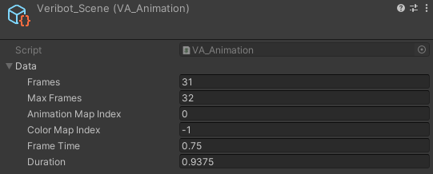
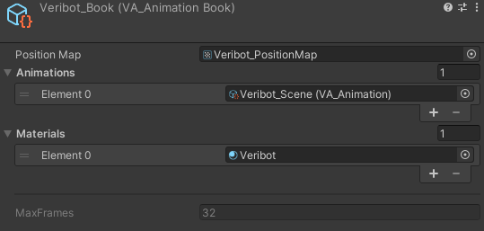
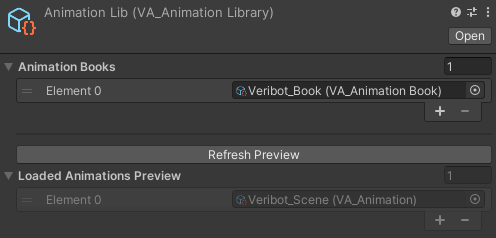
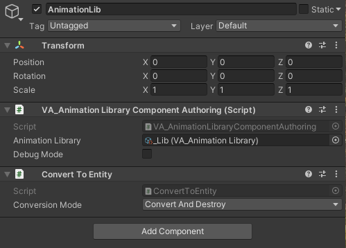

# VertexAnimation

### Getting Started

Import the sample assets to quickly get an idea on how to integrate vertex animation into your project.

## Components

### VA_ModelBaker

> Assets -> Create -> TAO -> VertexAnimation -> ModelBaker

This is the in engine converter. It allows you to bake out rig based animations into vertex animations. It will generate the positionMap and model with the right UV's.


| parameter | description |
| --- | --- |
| Model | Model with imported rig. |
| Animation Clips | Collection of animations to bake. |
| Fps | Frames per second to sample the animations with. |
| Texture Width | The width of the positionMap. |
| Apply Root Moation | Apply root motion on the animations. |
| Include Inactive | In or exclude inactive meshes. |
| --- | --- |
| Lod Settings - Quality | The quality of the model. % of verticies kept. |
| Lod Settings - Screen Relative Transition Height | When the LOD level changes. |
| Apply Animation Bounds | Applies the min and max bounds from all the animation frames, else the first frame bounds are used. |
| Generate Animation Book | Should it generate the animation book. |
| Generate Prefab | Output a prefab with all the LOD, Material and meshes applied. |
| Use Normal(A) | Toggles the shader keyword to use the normals stored in the positionMap aplha channel. |
| Use Interpolation | Toggles the shader keyword to use interpolation. |
| --- | --- |
| Bake | Bake the model and generate the output. |
| Delete Unused Animations | Deletes animations that have previously been baked but are not in the Animation Clips anymore. |
| Delete | Deletes the generated assets. |

### VA_Animation

Contains the information of the animation clip.  
Gets generated by the [VA_ModelBaker](#va_modelbaker). These assets can be used as a reference to the animation in other scripts. 

> The GetName() function returns a FixedString64 to get animation info from the [VA_AnimationLibrary](#va_animationlibrary) at runtime. This can be used to play and change animations.



### VA_AnimationBook

A collection of [VA_Animations](#va_animation), positionMap and materials that belong to the same model/positionMap.  
Gets generated by the [VA_ModelBaker](#va_modelbaker)



### VA_AnimationLibrary

> Assets -> Create -> TAO -> VertexAnimation -> ModelBaker

The animation library is a collection of [VA_AnimationBooks](#va_animationbook) that can be loaded in. This can be used to organize active/used animations.  
This is needed to play animations and gets loaded in by the VA_AnimationLibraryComponentAuthoring script. You only need one of these in you scene.



VA_AnimationLibraryComponentAuthoring setup.



### API

Have a look at the samples to get started. The [SampleAnimationSystemsAuthoring](/Samples~/Example1/Scripts/SampleAnimationSystemsAuthoring.cs) script shows 2 ways to play animations.

**Important Classes**

> VA_AnimatorComponent(Authoring) - This is placed on the Parent entity. It is used to indentify which entities have children with animations (VA_AnimationDataComponent). The relationship is important to update all the children with the same animation information, else when switching LOD's they are out of sync. It also keeps track of the current state of the animation and has a BlobAssetReference to the VA_AnimationLibraryData, this is where the runtime animation info is stored.

> VA_AnimatorSystem - This is where all the animation data (VA_AnimationDataComponent) gets updated with the data from the VA_AnimatorComponent.

**Example code**

```C#
// Example system to set the animation by name.
// This could be in a state of a state machine system.
[UpdateBefore(typeof(VA_AnimatorSystem))]
public class PlayAnimationByNameSystem : SystemBase
{
	public FixedString64 animationName;

	protected override void OnCreate()
	{
		base.OnCreate();

		Enabled = false;
	}

	protected override void OnUpdate()
	{
		float deltaTime = UnityEngine.Time.deltaTime;
		FixedString64 an = animationName;

		Entities.ForEach((Entity entity, ref VA_AnimatorComponent ac) =>
		{
			// Get the animation lib data.
			ref VA_AnimationLibraryData animationsRef = ref ac.animationLibrary.Value;

			// Set the animation index on the AnimatorComponent to play this animation.
			ac.animationIndex = VA_AnimationLibraryUtils.GetAnimation(ref animationsRef, an);

			// 'Play' the actual animation.
			ac.animationTime += deltaTime * animationsRef.animations[ac.animationIndex].frameTime;

			if (ac.animationTime > animationsRef.animations[ac.animationIndex].duration)
			{
				// Set time. Using the difference to smoothen out animations when looping.
				ac.animationTime -= animationsRef.animations[ac.animationIndex].duration;
			}
		}).ScheduleParallel();
	}
}
```