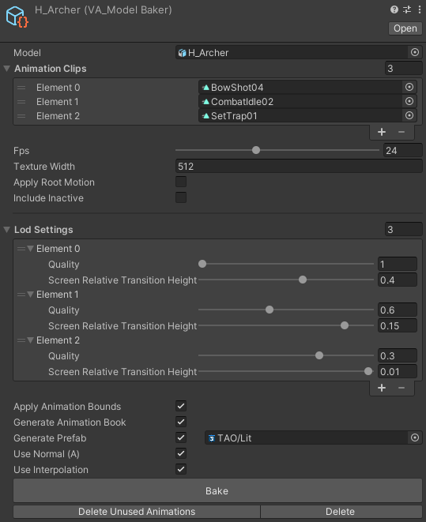
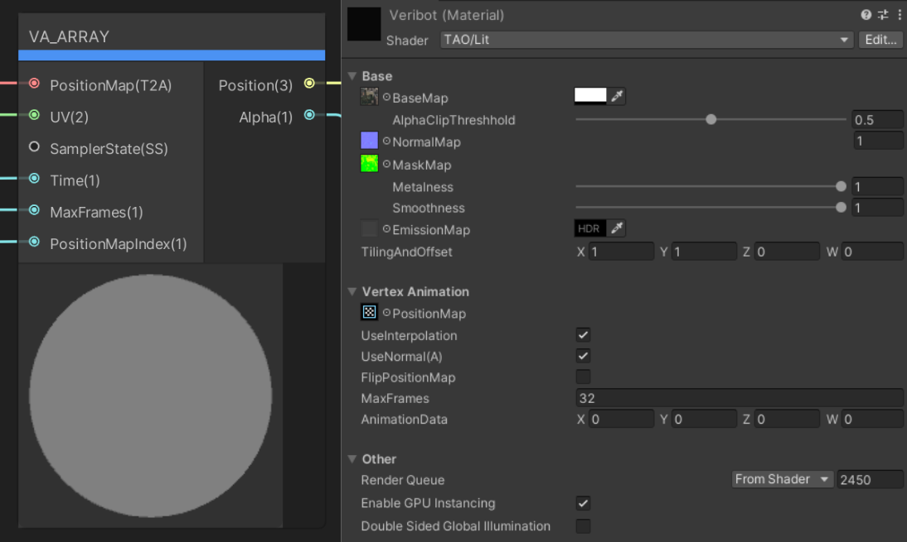

# Vertex Animation
## This works with Entities 1.0

This is a a animation system for skinned meshes in ECS, it includes a baking tool and the shaders to render the data.

It is based on this framework https://github.com/maxartz15/VertexAnimation


I forked this framework and fixed it for Entities 1.0

Here you can find a video of it in action:
https://youtu.be/yOddkGkct8w


Original Readme:
# TECH ART OUTSOURCE - Vertex Animation


A vertex animation baking tool, shaders, and animation system for Unity DOTS/ECS.  
Render tens of thousands of models at the same time each with its own animation state.  

## Features

- Vertex animation model baker
  - Multiple animations (stored in one Texture2DArray)
  - LOD generation
  - Prefab generation
  - Animation book generation
- DOTS animation system
  - Simple API
  - Animation library and books
- Shaders
  - Lit vertex animation shader
  - Interpolation
  - Normal encoding and decoding
  - Shader graph support

### Model Baker

Artist friendly GUI for converting models.



### DOTS Animation System

Sample code to play an animation.

```C#
protected override void OnUpdate()
{
    float deltaTime = UnityEngine.Time.deltaTime;

    Entities.ForEach((Entity entity, ref VA_AnimatorComponent ac) =>
    {
        // Get the animation lib data.
        ref VA_AnimationLibraryData animationsRef = ref ac.animationLibrary.Value;

        // Set the animation index on the AnimatorComponent to play this animation.
        ac.animationIndex = VA_AnimationLibraryUtils.GetAnimation(ref animationsRef, animationName);

        // 'Play' the actual animation.
        ac.animationTime += deltaTime * animationsRef.animations[ac.animationIndex].frameTime;
    }).ScheduleParallel();
}
```

### Shaders

Lit example shader (build in shader graph).  
Full shader graph support.



## Install

[Installing from a Git URL](https://docs.unity3d.com/Manual/upm-ui-giturl.html)

[Documentation](Documentation~/VertexAnimation.md)

## Getting Started

- Example 1: Mainly used for testing.
- Example 2: Contains an animation system that shows how you could setup animated characters and a spawning system to test performance.
- Example 3: MonoBehaviour example for if you are not using DOTS.

## Extra Info

This project is developed by the TAO (Tech Art Outsource) group at BUAS (Breda University of Applied Sciences).


There are plenty of improvements to be made, e.g.:
- (Optional) per bone vertex animation (instead of per-vertex), this can reduce the texture size needed to store the animations.
- Add option to export rotation map separately instead of compressing into the alpha channel, this will make it slower but higher quality.
- The LOD generation is very basic and slow, the ability to swap out algorithms would be cool.
- Split different modules into separate packages (LOD generation, animation baker + shaders, and the animation system)?
- Multi-material and/or sub-meshes support.

## Used By

- [Vedelem: The Golden Horde](https://store.steampowered.com/app/1517150/Vedelem_The_Golden_Horde/)
- Your project?

## LICENSE

Overall package is licensed under [MIT](/LICENSE.md), unless otherwise noted in the [3rd party licenses](/THIRD%20PARTY%20NOTICES.md) file and/or source code.
